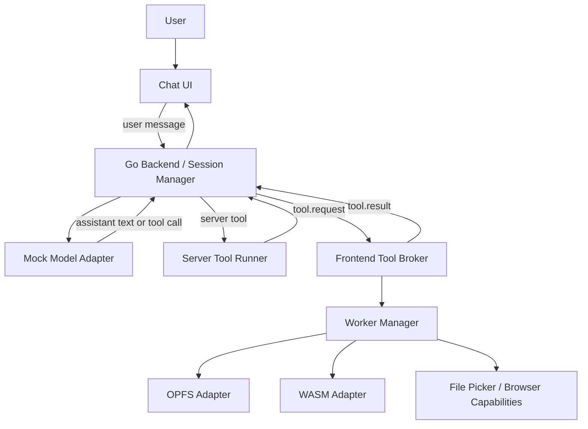

# Client-side tool broker design and implementation guide

## Executive Summary

This ticket defines a proof-of-concept chat system where the **Go backend owns the conversation and the model session**, while the **browser owns capability-bound tools** such as OPFS access, WASM workers, file pickers, and other browser-only actions. The backend is the control plane; the frontend is the execution plane for local capabilities.

The implementation is intentionally simplified:

- **LLM calls are mocked** rather than sent to a real provider.
- **Policy and consent orchestration are not modeled** beyond a minimal tool allowlist and schema validation.
- The primary goal is to validate the **routing contract**: the model emits a tool call, the backend decides where it executes, the browser performs client-side work, and the result returns to the backend for the next turn.

The design is useful because it lets us test the hardest architectural question first: **how do we safely mix server-side and browser-side tool execution without letting the model directly touch browser internals?**

## Problem Statement and Scope

### The problem

The system needs to support tools that cannot or should not run on the server. Examples include:

- reading and writing files in the browser’s origin-private file system (OPFS)
- running CPU-heavy local work in Web Workers or WASM modules
- accessing browser-only capabilities like file pickers or local UI state

At the same time, the chat backend still needs to own the conversation, stream assistant text, keep session state, and decide when a tool call should be executed. If the model could talk directly to browser APIs, the architecture would lose its trust boundary and become hard to reason about.

### Scope for this proof of concept

This ticket covers the following:

- a Go backend orchestrator
- a browser-side tool broker
- a routed RPC protocol for tool requests and results
- mocked model responses that simulate tool calls
- local-only and model-visible tool result handling
- an implementation guide and file layout for the first build

This ticket does **not** cover:

- production LLM provider integration
- durable policy, consent, tenancy, or audit enforcement
- multi-user collaboration
- arbitrary third-party plugin loading
- advanced security hardening beyond basic validation and allowlists

That narrow scope is intentional. The goal is to prove the architecture with the smallest possible number of moving parts.

## Current-State Snapshot

The current repository workspace contains **docmgr scaffolding only**. There is no application source code yet; the tree consists of ticket metadata and the `ttmp/` document workspace. That means this design doc is the first authoritative statement of how the implementation should be shaped.

This matters because the rest of the system must be built from scratch around the contract described here. There is no legacy runtime to preserve and no existing tool router to retrofit.

## Proposed Solution

### Architectural summary

Use a single-agent, routed-tool architecture:

- the **Go backend** maintains the session and conversation history
- the backend uses a **mock model adapter** that emits assistant text or tool calls
- the backend owns a **tool router** that decides whether a tool runs server-side or client-side
- the browser contains a **tool broker** that validates and dispatches client-side tools
- the broker uses **workers** for OPFS and WASM tasks so the UI thread stays responsive

The architecture is split into two trust boundaries:

1. **Backend broker / orchestrator**
   - authoritative for the session
   - owns the conversation state
   - builds the list of available tools for the current turn
   - routes each tool call to the correct executor

2. **Frontend broker / capability executor**
   - owns browser-only capabilities
   - executes OPFS and WASM work locally
   - returns structured tool results to the backend

The model never receives direct ambient access to the browser runtime. It only sees named tools with narrow input/output schemas.

### High-level diagram



### End-to-end request flow

1. The user sends a prompt from the chat UI.
2. The backend stores the user message in the session transcript.
3. The backend calls the mock model adapter with:
   - conversation history
   - current tool manifest snapshot
   - session metadata
4. The mock model either:
   - returns assistant text, or
   - emits one or more tool calls
5. The backend routes each tool call:
   - `execution=server` → run locally in Go
   - `execution=client` → send a `tool.request` to the browser
6. The frontend tool broker validates the request and dispatches it to a browser capability adapter or worker.
7. The browser returns a structured `tool.result`.
8. The backend appends the result to the conversation and calls the mock model again.
9. The final assistant text is streamed to the UI.

### Tool classes

Keep the tool catalog explicit. Do not blur the boundary between server and client execution.

#### 1. Server tools

Server tools run only in Go.

Examples:

- `kb.search`
- `conversation.summarize`
- database lookups
- internal API calls

These tools are appropriate when the operation uses secrets, trusted infrastructure, or data that should never leave the server.

#### 2. Client tools

Client tools run only in the browser.

Examples:

- `opfs.read_text`
- `opfs.write_text`
- `opfs.list_dir`
- `wasm.run_task`
- `browser.pick_file`

These tools are appropriate when the capability depends on local browser state or local files.

#### 3. Hybrid tools

Hybrid tools split the work between browser and backend.

Examples:

- `index_local_project`
- `summarize_local_pdf`
- `run_notebook_cell`

For this proof of concept, hybrid tools should be treated as future extensions. The first implementation should keep the execution path easy to trace.

## Tool Contract Model

### Manifest fields

Each tool manifest should declare:

- `name`: unique tool identifier
- `description`: human-readable purpose
- `execution`: `server` or `client`
- `visibility`: `local_only`, `model_visible`, or `user_visible_only`
- `capability`: the browser capability required, if any
- `input_schema`: JSON Schema for arguments
- `output_schema`: JSON Schema for results
- `requires_confirmation`: optional boolean for future expansion; keep it unused in the POC unless a UI prompt is explicitly needed

### Example manifest

```json
{
  "name": "opfs.read_text",
  "description": "Read a UTF-8 text file from the origin-private file system.",
  "execution": "client",
  "visibility": "model_visible",
  "capability": "opfs",
  "input_schema": {
    "type": "object",
    "properties": {
      "path": { "type": "string" },
      "max_bytes": { "type": "integer", "minimum": 1, "maximum": 1048576 }
    },
    "required": ["path"]
  },
  "output_schema": {
    "type": "object",
    "properties": {
      "path": { "type": "string" },
      "text": { "type": "string" },
      "truncated": { "type": "boolean" }
    },
    "required": ["path", "text", "truncated"]
  }
}
```

```json
{
  "name": "wasm.run_task",
  "description": "Run a named local WASM task in a dedicated worker.",
  "execution": "client",
  "visibility": "local_only",
  "capability": "wasm_worker",
  "input_schema": {
    "type": "object",
    "properties": {
      "task": { "type": "string", "enum": ["grep", "tokenize", "embed", "transcode"] },
      "args": { "type": "object" },
      "timeout_ms": { "type": "integer", "maximum": 30000 }
    },
    "required": ["task", "args"]
  }
}
```

### Visibility model

Use `visibility` to prevent accidental exfiltration of local data:

- `local_only`: the browser executes the tool and only a minimal success/failure summary returns to the backend
- `model_visible`: the result returns to the backend and is passed into the model context
- `user_visible_only`: the result is shown to the user but not fed back into the model unless explicitly rewrapped later

For the POC, this can be a simple enum and a couple of code paths. Do not turn it into a policy engine yet.

## API Sketch

### Backend endpoints

A small HTTP + WebSocket surface is enough for the first version.

#### Suggested backend API

- `POST /api/sessions`
  - creates a new chat session
  - returns session id and websocket URL

- `POST /api/sessions/{sessionID}/messages`
  - sends a user message into the backend-owned conversation
  - starts or continues the mock model turn

- `GET /api/sessions/{sessionID}/events` or `WS /api/sessions/{sessionID}/events`
  - streams backend events, assistant tokens, tool requests, and tool results

If the implementation prefers one bidirectional WebSocket per session, that is fine. The important part is that the backend owns the session and the browser receives explicit tool envelopes.

### Event envelopes

#### Capability snapshot

```json
{
  "type": "session.capabilities",
  "capabilities": {
    "opfs": true,
    "wasm_worker": true,
    "file_picker": true,
    "max_local_read_bytes": 1048576,
    "supported_tools": [
      "opfs.list_dir",
      "opfs.read_text",
      "opfs.write_text",
      "wasm.run_task"
    ]
  }
}
```

#### Tool request

```json
{
  "id": "call_123",
  "type": "tool.request",
  "tool": "opfs.read_text",
  "args": {
    "path": "/projects/a.txt",
    "max_bytes": 200000
  }
}
```

#### Tool result

```json
{
  "id": "call_123",
  "type": "tool.result",
  "ok": true,
  "output": {
    "path": "/projects/a.txt",
    "text": "...",
    "truncated": false
  },
  "meta": {
    "duration_ms": 42,
    "bytes_read": 18231
  }
}
```

#### Tool error

```json
{
  "id": "call_123",
  "type": "tool.result",
  "ok": false,
  "error": {
    "code": "CLIENT_UNAVAILABLE",
    "message": "No active browser client is connected for local tool execution."
  }
}
```

### Message semantics

A tool result must always correlate with the request that created it. The backend should treat `id` as the primary correlation key and reject stale or unknown completions.

## Backend Design

### Session manager

The Go backend needs a session manager that stores:

- conversation history
- current tool manifest snapshot
- connected browser clients
- pending tool calls
- timestamps and request correlation ids

The session manager should keep the conversation as the source of truth. The browser is a capability provider, not the system of record.

### Mock model adapter

Because this is a proof of concept, the model adapter should be deterministic and mockable.

Good behaviors for the mock adapter:

- emit fixed tool calls for known prompts
- return canned assistant text for simple inputs
- simulate multi-step tool loops
- expose a seam where a real provider can later be inserted

The adapter should not try to be clever. Its job is to prove orchestration.

### Tool router

The router should be a small `switch` or dispatch table.

```go
switch tool.Execution {
case "server":
    result = serverRunner.Run(ctx, tool, args)
case "client":
    result = clientBridge.Call(ctx, sessionID, tool, args)
default:
    return fmt.Errorf("unknown execution location: %s", tool.Execution)
}
```

### Client bridge

The bridge is the backend side of the browser connection.

Responsibilities:

- serialize tool requests
- wait for tool results with a timeout
- cancel outstanding calls on disconnect
- reject client tools if no frontend is attached
- surface client unavailability as a structured error

Keep the bridge protocol-specific and thin. It should not know how OPFS or WASM works internally.

## Frontend Design

### Frontend tool broker

The browser should contain one singleton tool broker that receives requests from the backend and routes them to local executors.

Responsibilities:

- validate incoming tool requests
- dispatch to a local adapter or worker
- normalize success and error payloads
- maintain a list of available capabilities
- surface a visible execution log in the UI

The broker is the browser-side mirror of the backend router.

### Worker manager

Use workers for anything CPU-heavy or file-system-sensitive.

```text
UI thread
  └─ Tool broker
       ├─ request router
       ├─ result normalizer
       └─ worker manager
            ├─ OPFS worker
            ├─ parser worker
            └─ WASM worker pool
```

The UI thread should do only coordination and rendering. File parsing, chunking, and scanning belong in workers.

### OPFS adapter

The OPFS adapter should act like a small filesystem API.

Recommended operations:

- `opfs.stat`
- `opfs.list_dir`
- `opfs.read_text`
- `opfs.read_bytes`
- `opfs.write_text`
- `opfs.write_bytes`
- `opfs.delete`
- `opfs.move`

For large reads, support paging:

```json
{
  "path": "/big.log",
  "offset": 0,
  "length": 65536
}
```

The implementation should avoid reading entire files into memory when a smaller slice is enough.

### WASM adapter

Treat WASM as a sandboxed compute engine, not as an extension point for arbitrary third-party code.

Good uses in this POC:

- grep-like local search
- tokenization
- local indexing
- deterministic transforms
- document parsing

The WASM worker should support:

- a registry of allowed tasks
- hard timeouts
- worker termination on cancel
- bounded memory assumptions

## Pseudocode

### Backend orchestration loop

```go
func HandleUserMessage(sessionID string, msg UserMessage) error {
    session := sessions.Load(sessionID)
    session.AppendUser(msg)

    for {
        request := BuildModelRequest(session)
        response := mockModel.Generate(request)

        switch response.Kind {
        case AssistantText:
            session.AppendAssistantText(response.Text)
            StreamToClient(sessionID, response.Text)
            return nil

        case ToolCall:
            tool := session.LookupTool(response.ToolName)

            var result ToolResult
            switch tool.Execution {
            case "server":
                result = serverRunner.Run(tool, response.Args)
            case "client":
                result = clientBridge.Call(sessionID, tool, response.Args)
            }

            session.AppendToolResult(response.CallID, result)
            continue
        }
    }
}
```

### Frontend broker loop

```ts
async function onToolRequest(msg: ToolRequestEnvelope) {
  validateEnvelope(msg)

  const tool = registry.get(msg.tool)
  if (!tool) {
    return sendToolResult({
      id: msg.id,
      ok: false,
      error: { code: "UNKNOWN_TOOL", message: msg.tool }
    })
  }

  try {
    const output = await tool.execute(msg.args)
    return sendToolResult({ id: msg.id, ok: true, output, meta: buildMeta() })
  } catch (err) {
    return sendToolResult({
      id: msg.id,
      ok: false,
      error: normalizeError(err)
    })
  }
}
```

### Worker dispatch

```ts
switch (task) {
  case "grep":
    return grepWorker.run(args)
  case "tokenize":
    return parserWorker.run(args)
  case "embed":
    return wasmPool.run(args)
  default:
    throw new Error(`Unsupported task: ${task}`)
}
```

## Implementation Plan

### Phase 1: Create the backend skeleton

Build the smallest Go service that can accept a user message, store a conversation, and emit a deterministic mock model response.

Recommended file layout:

```text
backend/
  cmd/chatd/main.go
  internal/chat/session.go
  internal/chat/mockmodel.go
  internal/chat/router.go
  internal/chat/contracts.go
  internal/chat/transport/ws.go
```

What each file should do:

- `main.go`: start HTTP and WebSocket server
- `session.go`: keep per-session history and pending calls
- `mockmodel.go`: return canned assistant text or a fixed tool call
- `router.go`: route server vs client execution
- `contracts.go`: define envelopes and manifest structs
- `ws.go`: manage session channels and stream events

### Phase 2: Create the browser broker

Implement the frontend singleton that listens for tool requests and executes them locally.

Recommended file layout:

```text
frontend/
  src/tool-broker/broker.ts
  src/tool-broker/contracts.ts
  src/tool-broker/registry.ts
  src/workers/opfs.worker.ts
  src/workers/wasm.worker.ts
  src/workers/parser.worker.ts
  src/app/ChatView.tsx
```

What each file should do:

- `broker.ts`: entry point for request handling
- `contracts.ts`: shared event and manifest types
- `registry.ts`: map tool names to executors
- `opfs.worker.ts`: file-system operations
- `wasm.worker.ts`: compute-heavy tasks
- `parser.worker.ts`: parsing / text scanning
- `ChatView.tsx`: show chat and execution log

### Phase 3: Implement the local adapters

Start with only the tools needed for the demo:

- `opfs.list_dir`
- `opfs.read_text`
- `opfs.write_text`
- `wasm.run_task(task=grep|parse|index)`

Do not implement a large generic tool abstraction yet. Keep the first version small enough that a new engineer can reason about the whole call path in one sitting.

### Phase 4: Wire the mock model turn loop

Add a deterministic prompt-to-tool mapping so the demo can show a complete round-trip.

Examples:

- “search my local project for TODOs” → `wasm.run_task(task=grep)`
- “read this file and summarize it” → `opfs.read_text`
- “save the transformed content” → `opfs.write_text`

The mock model should be hardcoded and transparent. The point is to validate orchestration, not language generation.

### Phase 5: Add tests and demo fixtures

Add tests for:

- envelope validation
- request/result correlation
- backend routing decisions
- worker timeout handling
- OPFS paging behavior
- mock model turn sequencing

Add a small demo scenario with local files so the round trip can be reproduced during review.

## Testing and Validation Strategy

### Backend tests

Use Go unit tests for:

- session lifecycle
- tool routing
- tool call timeouts
- unknown tool handling
- disconnect handling

### Frontend tests

Use browser-level or Playwright-style tests for:

- tool request receipt
- worker dispatch
- OPFS read/write round trips
- error propagation when a worker fails
- cancel / timeout behavior

### End-to-end checks

At minimum, validate the following two user stories:

1. **Read a local file and answer questions about it**
   - browser reads the file
   - backend receives a structured result
   - mock model generates an answer from the returned text

2. **Transform local files and save results locally**
   - browser scans local content with WASM or a parser worker
   - browser writes results back to OPFS
   - backend only sees the final structured status, unless the tool is explicitly model-visible

### What success looks like

The POC is successful when a reviewer can trace a single request from user input to tool execution and back without guessing where the authority boundary lives.

## Risks, Alternatives, and Open Questions

### Risks

- **Disconnects**: the browser may suspend or close while a tool is running.
- **Quota limits**: OPFS storage may run out or evict data.
- **Large payloads**: reading too much local text can overwhelm the model context.
- **Protocol drift**: if the frontend and backend envelopes diverge, tool calls will fail in confusing ways.

### Alternatives considered

#### 1. Let the model talk directly to the browser

Rejected because it breaks the trust boundary and makes tool execution harder to audit.

#### 2. Put everything on the server

Rejected because browser-only capabilities would disappear, and the architecture would no longer validate the local-execution use case.

#### 3. Build multi-agent orchestration first

Rejected because it adds control-plane complexity before the core routing problem is understood.

#### 4. Introduce a full policy engine now

Rejected for this ticket. The POC should prove the execution split first. Policy can be layered in after the call path is stable.

### Open questions

- Should the first transport be WebSocket only, or should it keep an HTTP bootstrap plus WS events?
- Which tool results should be `local_only` versus `model_visible` in the demo?
- Should the browser broker support multiple tabs, or just one active client session?
- How should cancelation be represented when a worker is terminated mid-task?

## References

### Primary companion documents

- [Client-side tool broker API reference](../reference/01-client-side-tool-broker-api-reference.md)
- [Diary](../reference/02-diary.md)

### External references

- OpenAI tool calling guide: https://developers.openai.com/api/docs/guides/function-calling
- MDN Origin private file system: https://developer.mozilla.org/en-US/docs/Web/API/File_System_API/Origin_private_file_system
- MDN Web Workers guide: https://developer.mozilla.org/en-US/docs/Web/API/Web_Workers_API/Using_web_workers
- MDN `createSyncAccessHandle`: https://developer.mozilla.org/en-US/docs/Web/API/FileSystemFileHandle/createSyncAccessHandle
- MDN WebAssembly overview: https://developer.mozilla.org/en-US/docs/WebAssembly
- MDN `postMessage`: https://developer.mozilla.org/en-US/docs/Web/API/Window/postMessage

### File references and suggested implementation targets

The workspace now contains the first implementation scaffold. The files below are the current anchors for the backend/frontend split and the next likely places to change as the POC matures:

- `backend/cmd/chatd/main.go`
- `backend/internal/chat/browserbridge.go`
- `backend/internal/chat/browserbridge_test.go`
- `backend/internal/chat/contracts.go`
- `backend/internal/chat/http.go`
- `backend/internal/chat/mockbridge.go`
- `backend/internal/chat/mockmodel.go`
- `backend/internal/chat/router.go`
- `backend/internal/chat/service.go`
- `backend/internal/chat/service_test.go`
- `frontend/src/tool-broker/broker.ts`
- `frontend/src/tool-broker/contracts.ts`
- `frontend/src/tool-broker/opfs-executors.ts`
- `frontend/src/tool-broker/registry.ts`
- `frontend/src/tool-broker/worker-client.ts`
- `frontend/src/tool-broker/wasm-executors.ts`
- `frontend/src/workers/opfs.worker.ts`
- `frontend/src/workers/parser.worker.ts`
- `frontend/src/workers/wasm.worker.ts`
- `frontend/src/app/ChatView.tsx`

These paths are implementation guidance and review anchors, not a statement that everything is production-ready.
