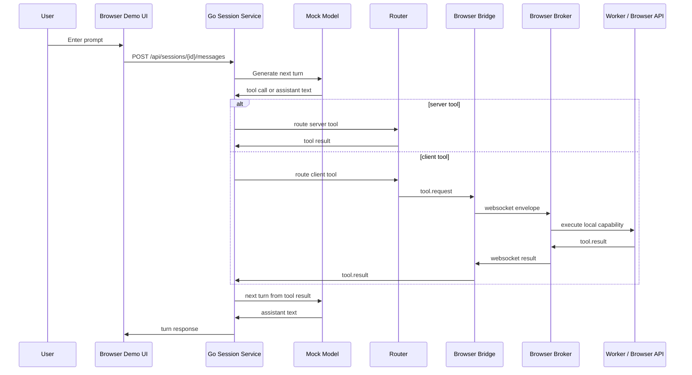

# Browser-Owned Capability Execution for Chat

This note is a narrative field guide for a pattern that looks deceptively simple at first: a chat backend owns the conversation, but the browser owns the local powers that the backend cannot, or should not, access directly. The concrete reference implementation is the repository at `/home/manuel/code/wesen/2026-04-17--client-side-chat`, but this note is written to preserve the reusable idea rather than the details of one repo.

The story behind the pattern is practical. Once a chat system needs to inspect OPFS, work with browser-only capabilities, or run local compute in workers and WASM, the old assumption that “the server does everything” stops working. At that point, the interesting problem is not just tool calling. The interesting problem is how to split responsibility so the model can still reason in one place while execution happens in the right place.

> [!summary]
> The pattern in this note has four enduring ideas:
> 1. keep the **conversation and routing** in the backend
> 2. keep **browser-local capabilities** in the browser
> 3. connect the two with a **structured request/result protocol** instead of ad hoc callbacks
> 4. make the system debuggable by surfacing **tool metadata, worker telemetry, and browser console evidence**

## Why this note exists

A lot of chat systems start with a seductive simplification: the model answers, the backend relays, and any needed tools run wherever it is convenient. That works right up until one of the tools is inherently browser-local. Reading and writing OPFS files is browser-local. File pickers are browser-local. Worker-backed compute is browser-local. Even when a server could theoretically emulate some of those actions, emulation often creates a worse system because it hides the real boundary.

This note exists because the boundary matters.

If the backend can directly reach into the browser’s local storage, then the architecture has become ambiguous. If the browser can make arbitrary choices about model turns, then the control plane is no longer clear. The pattern this note preserves is the middle path: the backend owns the conversation, the browser owns local capability execution, and the two communicate through a narrow protocol that can be traced, logged, and debugged.

That may sound like a small architectural decision, but it is actually the part that keeps the whole system coherent. Once you decide that the browser is a first-class execution environment, a lot of design questions become much easier:

- where should OPFS live?
- where should a WASM module be instantiated?
- who decides whether a tool is allowed to run?
- how do you know which result came from which tool call?
- how do you keep the model from directly depending on browser internals?

The repo answers those questions in a compact way, and this note explains the answer as a reusable pattern.

## When to use this pattern

Use this pattern when your chat or agent system needs at least one of the following:

- browser-only storage, especially OPFS
- local file handling that should remain inside the tab
- worker-backed local compute
- a clean split between server trust and browser capability
- a runnable demo that a reviewer can inspect in DevTools without extra infrastructure
- a simple proof-of-concept that should later grow into a stronger execution architecture

Do not use this pattern if the browser is merely acting as a thin display surface and all meaningful work belongs on the server. In that case, introducing a browser tool broker will only add complexity.

This pattern is also not the right fit if the system needs a production-grade consent model, multi-tenant policy enforcement, or a comprehensive permissions framework right away. The architecture can grow there, but this note is about the simpler shape first: prove that browser-owned capability execution works at all, then harden it.

## The core mental model

The best mental model is not “chat app with some browser features.” It is this:

> the backend is the **control plane**, and the browser is the **execution plane** for local capabilities.

That sentence sounds abstract until you walk through a single request.

A user types a prompt. The backend stores it in a session. A model-like component, even if mocked, decides whether the next step is text or a tool call. If the tool is server-side, the backend runs it. If the tool is browser-side, the backend emits a request to the browser over the session channel. The browser executes the tool in a worker or via a browser API, returns a structured result, and the backend feeds that result back into the turn loop.

That is the whole trick.

The key thing to notice is that the model never gets to call browser APIs directly. The browser never gets to decide the conversation policy. Each side has a job, and the protocol between them is explicit.

A useful shorthand is:

- **backend decides**
- **browser executes**
- **result returns**
- **backend closes the loop**

If you can keep that sentence in your head while reading the code, the rest of the system becomes much easier to understand.

## The architecture as a story

Imagine the flow of one request as a short story.

A user opens the demo in the browser. The page is served from the same Go process that also serves the API and websocket endpoint. That matters because the browser does not have to juggle origins or proxy layers just to speak to the backend. The demo creates a session, connects a websocket client, and sends a capability snapshot so the backend can see what the browser can actually do.

Then the user sends a prompt such as `Browse OPFS /notes` or `Search my local project for TODOs.` A mock model looks at the latest user message and, based on simple routing rules, emits a tool call rather than a final answer. The backend receives that tool call and asks a router a very specific question: is this tool server-side or client-side?

If the tool is server-side, the backend runs it. If the tool is client-side, the backend does not try to fake it. It sends a `tool.request` envelope to the browser session bridge. The browser broker receives the request, looks up the manifest, dispatches to a worker or browser API, and eventually sends back a `tool.result` envelope. That result becomes part of the session transcript. The backend then asks the model-like component for the next move, and the model converts the result into assistant text.

The result is a loop that feels like ordinary tool calling, but the execution location is no longer fixed.

That distinction is the reason this pattern is interesting. The model still sees a normal tool loop. The user still sees a normal chat interaction. But under the hood the execution plane has been split in a way that respects browser capabilities rather than pretending they are server capabilities.

## The shape of the system

The repo’s implementation makes the pattern tangible. The backend lives in Go under `backend/`, and the browser-facing demo and broker live under `frontend/src/`.

A few files deserve special attention because they define the skeleton of the system:

- `backend/cmd/chatd/main.go` starts the server and chooses the port.
- `backend/internal/chat/http.go` serves both the JSON API and the static frontend bundle from the same origin.
- `backend/internal/chat/service.go` runs the session turn loop.
- `backend/internal/chat/router.go` decides whether a tool executes on the server or in the browser.
- `backend/internal/chat/mockmodel.go` routes prompts using deterministic keyword rules so the demo stays predictable.
- `backend/internal/chat/browserbridge.go` keeps track of browser sessions and correlates requests and results.
- `backend/internal/chat/websocket.go` carries the browser session envelopes.
- `frontend/src/session/websocket-session-client.ts` speaks the websocket protocol from the browser.
- `frontend/src/tool-broker/broker.ts` receives tool requests and returns tool results.
- `frontend/src/tool-broker/registry.ts` defines the browser tool catalog.
- `frontend/src/workers/opfs.worker.ts` implements OPFS operations.
- `frontend/src/workers/wasm.worker.ts` instantiates a real demo WebAssembly module and uses it for task execution.
- `frontend/src/demo/browser-chat-demo.ts` ties the UI, the session client, the broker, and the diagnostics together.

The important thing is not just that these files exist, but that they divide the world cleanly. The backend owns session state and routing. The browser owns local capability execution. The UI is a witness, not the arbiter.

## Control plane and execution plane

One of the easiest ways to understand the pattern is to think in terms of control plane and execution plane.

The control plane decides what should happen. It remembers the conversation, knows the current tools, and decides which executor is responsible for the current tool call. The execution plane performs the actual local work. In this repo, the execution plane happens to live in the browser, but the conceptual split generalizes to other systems too.

This division matters because it gives you a place to put each kind of concern.

The control plane is where you keep:

- sessions
- conversation messages
- tool manifests
- routing decisions
- session-level capabilities
- model turn loops

The execution plane is where you keep:

- OPFS reads and writes
- file-system style directory listings
- local browser worker execution
- WASM runtime startup
- browser-specific debug visibility

The pattern becomes more stable once you stop asking the browser to be a miniature backend. It is not one. It is a capable execution environment with its own rules and strengths.

## A sequence diagram of one turn



This diagram is intentionally linear. It is easier to debug a system when you can narrate the flow in a single paragraph and match it to the diagram.

## The protocol is the point

A pattern like this succeeds or fails on the shape of the protocol.

The protocol in this repo is based on a few core envelopes:

- `session.capabilities`
- `tool.request`
- `tool.result`

That is enough to keep the system comprehensible.

The session capability envelope says what the browser can do. The tool request says what should be executed. The tool result says what happened. That sounds obvious, but many systems lose clarity here by leaking browser state into the model or by using one generic event bus message for everything.

The project’s contract types live in `frontend/src/tool-broker/contracts.ts`, and the shape is mirrored on the backend side in `backend/internal/chat/contracts.go`. The dual definition is not accidental. It makes the protocol visible on both sides of the boundary.

A useful detail is that tool results are structured. They are not just strings. The result can carry:

- `output`
- `error`
- `meta`

That `meta` field is especially important for diagnostics because it lets the browser carry low-level runtime facts back across the boundary without forcing them into the model-visible content.

In the demo, that metadata includes things like:

- duration
- tool name
- visibility
- backend category
- worker-specific details such as OPFS summaries or WASM module information

That makes the protocol useful for both the model loop and the human operator.

## Why workers are the right place for browser-local tools

Once you start executing local browser tasks, workers quickly become the correct default. Not because every browser task must use a worker, but because workers make the execution boundary explicit and keep the UI thread clean.

The OPFS worker is a good example. It uses `navigator.storage.getDirectory()` and then does the file-system-like operations there. If the task is listing a directory, the worker can walk the directory. If the task is reading a file, the worker can cap the bytes read and return the text. If the task is writing a file, the worker can open a writable handle and commit the result.

The WASM worker is even more revealing. It does not merely pretend to be a WASM worker. It instantiates a real tiny WebAssembly module at startup, logs the initialization details, and then uses that runtime to validate local computation tasks. The worker’s console message is part of the evidence that the runtime is real.

This gives you two important benefits:

1. the UI stays responsive
2. the local capability execution becomes easier to observe and reason about

For this pattern, that is exactly the right tradeoff.

## The OPFS story

OPFS is one of the clearest examples of why this architecture makes sense.

OPFS is browser-local storage. It is not a server filesystem. It is not something the backend should pretend to own. In the repo, the browser broker exposes tools like `opfs.list_dir`, `opfs.read_text`, and `opfs.write_text`. Those tools are not special because they are complicated. They are special because they are local.

The OPFS implementation inside `frontend/src/workers/opfs.worker.ts` does a few sensible things:

- normalizes paths so the demo can speak in `/notes` style paths
- resolves directories segment by segment
- limits file reads with `max_bytes`
- returns metadata that describes what the worker actually did
- fails with a structured error if the browser does not support the needed API

The project also adds a small browser-visible shortcut: a `Browse OPFS` button in the demo fills the prompt with `Browse OPFS /notes`. That lets a reviewer see the flow without having to know the prompt format in advance.

This is a good lesson in UX for infrastructure-heavy demos: do not hide the hard thing behind a prompt if a direct affordance would make the behavior easier to validate.

## The WASM story

WASM in this repo plays two roles.

First, it demonstrates that the browser can run a real module inside a worker and expose its runtime information. Second, it gives the mock tool system something deterministic to do locally, which is ideal for a proof of concept.

The worker in `frontend/src/workers/wasm.worker.ts` instantiates a tiny demo module that exports `add`. That may look almost comically small, but it is enough to prove the important thing: the browser really loaded a WebAssembly module, and the worker can report what happened.

The worker’s metadata includes:

- module byte size
- export list
- initialization time

The console log helps with the debugging story because it gives the operator a browser-devtools proof point. The diagnostics modal helps because it brings the same evidence into the UI. Together, they answer the question “did WASM actually start?” in two different ways.

That dual visibility is worth keeping in mind for any similar pattern. If a feature is hard to trust, give it both a machine-readable trace and a human-readable signpost.

## A narrative walkthrough of the backend loop

The backend service in `backend/internal/chat/service.go` is the engine room.

A new session is created. The session is seeded with capabilities and with a stable tool manifest list. When a user message arrives, the service appends the message and enters a bounded loop. The mock model looks at the latest message and either answers directly or emits a tool call.

If a tool call is emitted, the service looks up the tool manifest, appends the tool call to the transcript, and routes the call through the router. The router chooses between server and browser execution. If the call belongs in the browser, the backend sends the request into the browser bridge. The browser bridge waits for the result, and once the result comes back, the service appends it to the transcript and asks the model for the next step.

The most important part of this loop is that it is bounded. The service will not spin forever. That matters even in a demo because it keeps the turn loop inspectable. It also makes the architectural shape obvious: this is a conversation with explicit intermediate state, not a magical text stream.

If you are trying to build a similar system from scratch, that bounded loop is one of the first things to copy.

## A narrative walkthrough of the browser loop

The browser side is deliberately humble.

`frontend/src/session/websocket-session-client.ts` opens the websocket session and sends a capability snapshot as soon as the connection is ready. The client then listens for incoming messages and forwards them to the broker.

The broker in `frontend/src/tool-broker/broker.ts` does not know about the whole application. It only knows how to receive a capability envelope, receive a tool request, look up a tool definition, execute it, and return the result. It also allows an observer to see incoming and outgoing messages. That observer powers the diagnostics panel.

The browser demo in `frontend/src/demo/browser-chat-demo.ts` is the glue. It creates the session, binds the websocket client to the broker, renders the transcript, and records a rolling log of runtime events. It is intentionally a DOM-based app rather than a framework-heavy one so that the shape of the architecture remains visible.

That last part is worth underlining. When the system under test is the architecture itself, the demo should stay lightweight. If the demo is too abstract, the architecture becomes harder to validate.

## The diagnostics panel as an engineering tool

The Diagnostics modal is not just a UI flourish. It is a practical part of the validation story.

When the browser tool broker receives a `tool.request`, the demo records that event. When the broker returns a `tool.result`, the demo records the result and, if present, the worker metadata. When the session connects, the demo records the websocket and capability exchange. When the mock model replies, the demo records that too.

That means the modal gives you a short history of the system’s recent life.

For a new engineer, this is one of the easiest ways to understand what is happening without opening half a dozen logs. You can click `Diagnostics` and see:

- what prompt was sent
- what tool was requested
- what result came back
- what metadata the worker reported
- what the assistant ultimately said

This is also a reminder that infrastructure software should make itself inspectable. A small modal can be more valuable than a large dashboard if it shows the right facts.

## Why same-origin serving matters

The backend serves the static frontend bundle from `frontend/dist` using `backend/internal/chat/http.go`. That decision keeps the demo clean.

Same-origin serving avoids a lot of noise:

- no CORS configuration for the demo
- no separate local frontend server to keep in sync
- no extra proxy hop for websocket traffic
- no confusion about which origin owns the worker bundles

For a proof of concept, this is exactly the right default. You can always split origins later if the product requires it, but while the architecture is being validated, one origin keeps the story simple.

## Debugging and failure modes

The pattern is powerful, but it has predictable failure modes.

### Missing worker bundles

The browser executors load real worker bundles from `frontend/dist/workers/*.js`. If those files are missing, the worker fails to initialize. That looks like a runtime problem, but it is often just a build artifact problem.

### Browser API availability

OPFS and some file picker APIs are browser-dependent. If the demo is opened in an environment that lacks those capabilities, the browser should return a structured error instead of crashing.

### Prompt routing is deterministic

The mock model uses keyword routing. That makes the demo stable, but it means a prompt must be phrased in a way the router understands. A sentence like `Browse OPFS /notes` is intentionally more useful than an ambiguous sentence like `show me stuff`.

### Capability snapshots can appear asymmetric

The backend knows session capabilities from its own view, and the browser sends its own snapshot over the websocket. Those are related but not identical. For a short period during startup, that can look confusing. It is not a bug as long as the websocket handshake completes and tool requests flow.

### Diagnostics are a window, not a warehouse

The modal keeps a limited window of events. That is good for clarity, but it means deeper debugging should fall back to the session transcript, browser console, and saved logs.

The takeaway is simple: this architecture is easy to reason about if you keep the logs and envelopes visible. It becomes hard to reason about if you hide everything behind a single opaque “success” message.

## Recommended implementation sequence

If you were building this pattern in a new repo, the most reliable order would be:

1. define the tool manifest shapes and request/result envelopes
2. implement the backend session loop with a mocked model
3. implement routing between server tools and browser tools
4. add a browser websocket client
5. add a browser tool broker with a registry
6. implement one browser-local tool in a worker, then a second one
7. add a diagnostics surface before adding polish
8. prove the flow in a real browser with a same-origin backend

That order matters because it separates contract work from execution work. The biggest mistakes in systems like this usually happen when people build the UI before the protocol, or the protocol before the turn loop.

## Pseudocode for the two halves

Backend side:

```go
func runTurn(session, model, router) {
    snapshot := session.Snapshot()
    response := model.Generate(snapshot)

    switch response.Kind {
    case AssistantText:
        session.AppendAssistantMessage(response.Text)
        return
    case ToolCall:
        tool := session.LookupTool(response.Tool)
        session.AppendToolCall(response.ToolCall)
        result := router.RouteTool(session.ID, tool, response.ToolCall.ID, response.ToolCall.Args)
        session.AppendToolResult(tool.Name, result)
        runTurn(session, model, router)
    }
}
```

Browser side:

```ts
async function handleToolRequest(message) {
  const definition = registry.get(message.tool)
  if (!definition) {
    sendError("UNKNOWN_TOOL")
    return
  }

  try {
    const execution = await definition.execute(message.args)
    sendResult({ output: execution.output, meta: execution.meta })
  } catch (error) {
    sendError(normalize(error))
  }
}
```

These snippets are small on purpose. The real value is not in the syntax; it is in the role separation they make visible.

## What to inspect in Firefox DevTools

If you want to verify the browser side of the pattern, open Firefox DevTools and inspect two things.

First, the Console. The WASM worker should log an initialization message that includes the module byte size, exports, and initialization timing. That is the easiest proof that a real WASM runtime started in the worker.

Second, the Network and Application-like runtime behavior. When the browser sends `tool.request` and receives `tool.result`, you should be able to correlate that with the demo’s Diagnostics modal. If you cannot, the problem is usually in the message bridge, not in the business logic.

That is the point of having both UI diagnostics and browser console output. They let you validate the same event from two different angles.

## How this generalizes

The pattern in this note is broader than chat.

Any system that has a strong server control plane and a browser-capable local execution plane can use the same shape. The browser might host file operations, local transforms, image processing, media extraction, notebook-style calculations, or device-adjacent actions. The control plane can still own the session, the conversation, or the orchestration graph.

The important invariant is not the chat UI. The important invariant is that local browser work is treated as a routed capability, not as an accidental side effect.

That distinction is what keeps the architecture understandable as it grows.

## Related notes

- [[PROJ - Client-side Tool Broker for Chat - Intern Research Guide|Client-side Tool Broker for Chat - Intern Research Guide]]
- `Projects/2026/04/17/CCS-0001--client-side-tool-broker-for-chat/design-doc/01-client-side-tool-broker-design-and-implementation-guide.md`
- `Projects/2026/04/17/CCS-0001--client-side-tool-broker-for-chat/reference/01-client-side-tool-broker-api-reference.md`
- `Projects/2026/04/17/CCS-0001--client-side-tool-broker-for-chat/playbook/01-run-the-browser-demo.md`
- `backend/internal/chat/service.go`
- `backend/internal/chat/router.go`
- `backend/internal/chat/browserbridge.go`
- `backend/internal/chat/websocket.go`
- `frontend/src/tool-broker/broker.ts`
- `frontend/src/workers/opfs.worker.ts`
- `frontend/src/workers/wasm.worker.ts`
- `frontend/src/demo/browser-chat-demo.ts`

## Closing thought

The deepest lesson in this architecture is not about chat, and it is not even about browsers. It is about respecting where work actually belongs.

The backend is best at keeping the conversation coherent. The browser is best at touching browser-local capabilities. The protocol between them should be narrow enough to reason about, rich enough to debug, and boring enough to survive growth.

That is the pattern this note is meant to preserve.
