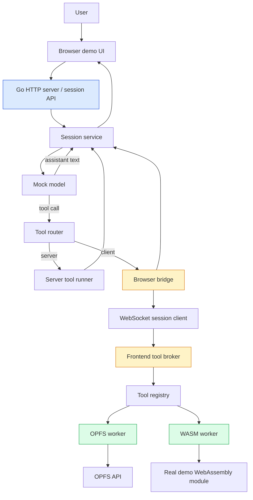

# Client-side Tool Broker for Chat

This project is a proof-of-concept chat system where the Go backend owns the conversation and session orchestration, while the browser owns local capabilities such as OPFS and WASM-backed work. The repo is intentionally small and intentionally mocked: the model is not a real provider, and there is no policy engine, but the system does prove the architectural boundary between server-side reasoning and browser-side execution.

This note is written as a research guide for an intern. It is meant to help someone who is new to the repo understand what the project is, why it exists, which files matter most, and how to verify that the whole loop is actually working in a browser.

> [!summary]
> The project currently has four important identities:
> 1. a **Go-backed chat orchestrator** that owns sessions, turns, and tool routing
> 2. a **browser execution plane** for OPFS, WASM, and other local-only capabilities
> 3. a **same-origin DOM demo** served by the backend so API, websocket, and UI stay easy to reason about
> 4. a **diagnostics-heavy POC** that makes tool requests, tool results, and WASM startup evidence visible in the UI and console

## Why this project exists

The main problem is simple: some useful chat-adjacent actions are browser-local and should not run on the server. Examples include reading and writing files in OPFS, scanning local content with a worker, or interacting with browser-only capabilities such as the file picker. At the same time, the chat backend still needs to own the conversation, keep the session state coherent, and decide when a tool call should happen.

If the model could talk directly to browser APIs, the boundary would become muddy very quickly. The point of this POC is to keep that boundary explicit:

- the backend decides *what* should happen next
- the browser executes capability-bound local work
- the result comes back as a structured tool result
- the backend feeds that result into the next turn

That gives us a clean way to test the hard part first: routed tool execution across a trust boundary.

The repository also exists as a learning scaffold. It is small enough that an intern can read the important files end to end, but rich enough to show the real engineering shape of a browser-executed tool system.

## Suggested reading order for an intern

If you are new to the repo, read it in this order:

1. **Design and API docs in `ttmp/`**
   - `/home/manuel/code/wesen/2026-04-17--client-side-chat/ttmp/2026/04/17/CCS-0001--client-side-tool-broker-for-chat/design-doc/01-client-side-tool-broker-design-and-implementation-guide.md`
   - `/home/manuel/code/wesen/2026-04-17--client-side-chat/ttmp/2026/04/17/CCS-0001--client-side-tool-broker-for-chat/reference/01-client-side-tool-broker-api-reference.md`
2. **Backend control flow**
   - `/home/manuel/code/wesen/2026-04-17--client-side-chat/backend/internal/chat/service.go`
   - `/home/manuel/code/wesen/2026-04-17--client-side-chat/backend/internal/chat/router.go`
   - `/home/manuel/code/wesen/2026-04-17--client-side-chat/backend/internal/chat/mockmodel.go`
3. **Browser transport and broker**
   - `/home/manuel/code/wesen/2026-04-17--client-side-chat/frontend/src/session/websocket-session-client.ts`
   - `/home/manuel/code/wesen/2026-04-17--client-side-chat/frontend/src/tool-broker/broker.ts`
   - `/home/manuel/code/wesen/2026-04-17--client-side-chat/frontend/src/tool-broker/contracts.ts`
4. **Worker-backed local tools**
   - `/home/manuel/code/wesen/2026-04-17--client-side-chat/frontend/src/workers/opfs.worker.ts`
   - `/home/manuel/code/wesen/2026-04-17--client-side-chat/frontend/src/workers/wasm.worker.ts`
5. **The demo shell**
   - `/home/manuel/code/wesen/2026-04-17--client-side-chat/frontend/src/demo/browser-chat-demo.ts`
   - `/home/manuel/code/wesen/2026-04-17--client-side-chat/frontend/src/app/ChatView.tsx`
6. **Operational validation**
   - `/home/manuel/code/wesen/2026-04-17--client-side-chat/ttmp/2026/04/17/CCS-0001--client-side-tool-broker-for-chat/playbook/01-run-the-browser-demo.md`

If you only have time to read three files, read `service.go`, `broker.ts`, and `browser-chat-demo.ts`.

## Current project status

The project is no longer just a sketch. It has a runnable backend, a browser demo, a websocket session transport, worker-backed local tools, and a diagnostics view that exposes low-level events.

### What works today

- a Go backend named `chatd`
- session creation and snapshot retrieval over HTTP
- a websocket browser transport at `/api/sessions/{sessionID}/ws`
- a browser-side tool broker that receives tool requests and sends tool results
- OPFS worker-backed tools:
  - `opfs.list_dir`
  - `opfs.read_text`
  - `opfs.write_text`
- a WASM worker-backed tool:
  - `wasm.run_task`
- a mocked model that deterministically routes prompts to tools based on keywords
- a DOM-based browser demo with:
  - `Send prompt`
  - `Load demo prompt`
  - `Browse OPFS`
  - `Diagnostics`
- a diagnostics modal that surfaces recent tool requests, tool results, and assistant replies
- real WASM runtime startup evidence in the browser console
- same-origin serving of `frontend/dist` from the Go backend
- Playwright smoke validation against `http://localhost:8090/`

### What is intentionally simplified

- LLM calls are mocked, not sent to a real provider
- there is no policy engine
- there is no durable persistence layer yet
- there is no multi-user collaboration model
- there is no complex consent workflow
- the demo is still intentionally lightweight and framework-free

### Honest one-sentence summary

The repo already proves the browser can act as a local tool execution plane, but it still uses a deterministic mock model and a thin demo UI so the architecture stays easy to inspect.

## Project shape

The repository has two main codebases and one documentation workspace.

### Backend: `backend/`

The backend owns the session state, the routing decision, and the HTTP/WebSocket surface.

Important files:

- `backend/cmd/chatd/main.go` — starts the server and reads `CHATD_ADDR`
- `backend/internal/chat/http.go` — serves the API and static frontend bundle
- `backend/internal/chat/service.go` — runs the session turn loop
- `backend/internal/chat/router.go` — routes tools to server or browser execution
- `backend/internal/chat/mockmodel.go` — prompt-to-tool heuristic model
- `backend/internal/chat/browserbridge.go` — in-memory browser session bridge
- `backend/internal/chat/websocket.go` — websocket envelope handling
- `backend/internal/chat/contracts.go` — shared session/tool/result types

### Frontend: `frontend/src/`

The frontend owns browser capabilities, the demo shell, and the browser transport.

Important files:

- `frontend/src/demo/browser-chat-demo.ts` — top-level demo app and diagnostics modal
- `frontend/src/app/ChatView.tsx` — DOM-based session transcript view
- `frontend/src/session/websocket-session-client.ts` — websocket session client and capability exchange
- `frontend/src/tool-broker/contracts.ts` — shared tool/session contract types
- `frontend/src/tool-broker/broker.ts` — browser-side broker that handles incoming tool requests
- `frontend/src/tool-broker/registry.ts` — tool manifest registry
- `frontend/src/tool-broker/opfs-executors.ts` — OPFS worker wrappers
- `frontend/src/tool-broker/wasm-executors.ts` — WASM worker wrapper
- `frontend/src/tool-broker/worker-client.ts` — generic worker request helper
- `frontend/src/workers/opfs.worker.ts` — actual OPFS implementation
- `frontend/src/workers/wasm.worker.ts` — actual WASM implementation and runtime telemetry
- `frontend/src/workers/parser.worker.ts` — supporting worker used by the demo bundle

### Documentation workspace: `ttmp/`

The ticket workspace contains the written project record:

- design doc
- API reference
- diary
- playbook
- changelog
- tasks
- index

Those docs are the durable trail for why the system is shaped the way it is.

## Architecture

At a high level, the system is split into a backend control plane and a browser execution plane.



The most important idea is that the backend never directly touches browser-only APIs. It only sees a tool manifest, a browser session, and a result envelope. That keeps the trust boundary obvious.

### The turn loop in plain language

1. The user sends a prompt.
2. The backend stores the user message in the session transcript.
3. The mock model looks at the latest message and decides whether to answer directly or emit a tool call.
4. If a tool call is needed, the backend checks the manifest and routes it.
5. Server tools run in Go.
6. Client tools go through the browser bridge to the tab.
7. The browser tool broker executes the request using workers or local browser APIs.
8. The result comes back to the backend.
9. The backend appends the result and asks the mock model for the final assistant turn.

That flow is deliberately simple and deterministic so the architecture can be debugged before any real provider integration is added.

## Implementation details

This is the section to read if you want to understand how the repo actually works.

### 1) Backend session orchestration

`backend/internal/chat/service.go` is the center of gravity. It creates sessions, seeds them with capabilities and tool manifests, and runs each turn through a bounded loop.

The key idea is that a single user message can produce several intermediate tool calls before the assistant replies. The backend keeps looping until the mock model returns assistant text or the max step count is reached.

Pseudo-flow:

```go
for up to 8 steps:
    snapshot := session.Snapshot()
    response := mockModel.Generate(snapshot)

    if response is assistant text:
        append assistant message
        return final turn

    if response is a tool call:
        tool := session.LookupTool(response.Tool)
        session.AppendToolCall(response.ToolCall)
        result := router.RouteTool(sessionID, tool, response.ToolCall.ID, response.ToolCall.Args)
        session.AppendToolResult(tool.Name, result)
        continue
```

That bounded loop matters. It prevents a broken mock model or an accidental tool loop from spinning forever.

The backend also has a browser-facing path:

- `HandleUserMessage(...)` handles the initial user prompt
- `HandleToolResult(...)` handles tool results coming back from the browser transport

The session model is intentionally small:

- session ID
- messages
- tool manifests
- capabilities snapshot

That keeps the transcript easy to inspect and serialize.

### 2) Tool routing and the browser bridge

`backend/internal/chat/router.go` is the actual trust boundary decision point.

It looks at the tool manifest:

- `execution: server` → run in Go
- `execution: client` → send to the browser bridge

If a runner is missing, the router returns a structured tool error such as `SERVER_UNAVAILABLE` or `CLIENT_UNAVAILABLE` rather than failing silently.

`backend/internal/chat/browserbridge.go` is what makes the browser path feel like a real RPC system rather than a toy event channel. It tracks:

- connected sessions
- session capabilities
- pending requests keyed by call ID
- response channels for in-flight tool calls

The bridge behavior is simple but important:

- `Call(...)` sends a `tool.request` to the browser and blocks waiting for the matching `tool.result`
- `SubmitResult(...)` resolves the matching pending request
- `Disconnect(...)` closes outstanding channels so the backend can fail fast if the tab disappears
- `timeoutToolResult(...)` and `unavailableToolResult(...)` preserve error details in a structured form

This is the point where the project stops being a normal chat loop and becomes a routed tool system.

### 3) Mock model routing rules

`backend/internal/chat/mockmodel.go` keeps the proof of concept deterministic.

It does not attempt semantic parsing. Instead, it uses keyword heuristics:

- “summarize conversation” → `conversation.summarize`
- “browse”, “list opfs”, “show opfs” → `opfs.list_dir`
- “todo” or “search” → `wasm.run_task` with `grep`
- “read” → `opfs.read_text`
- “save”, “write”, or “transform” → `opfs.write_text`

That is the right tradeoff for a POC because it removes model variability from the debugging story.

The interesting part is what happens after a tool result comes back. If the tool result contains a `summary` or `text`, the mock model uses that content in its final reply. Otherwise it falls back to a generic success message.

This makes the browser demo feel responsive even though the model itself is mocked.

### 4) The websocket session contract

`backend/internal/chat/websocket.go` is the browser transport boundary.

When the browser connects, the backend:

- accepts the websocket
- attaches the browser connection to the session bridge
- sends a `session.capabilities` envelope
- forwards tool requests from the bridge to the websocket
- receives either browser capability updates or tool results back from the browser

This is the shape of the browser-facing protocol:

```json
{
  "type": "tool.request",
  "id": "call_123",
  "tool": "opfs.read_text",
  "args": { "path": "/notes/today.md" }
}
```

```json
{
  "type": "tool.result",
  "id": "call_123",
  "ok": true,
  "output": { "path": "/notes/today.md", "text": "...", "truncated": false },
  "meta": { "duration_ms": 42, "tool": "opfs.read_text" }
}
```

There is also a `session.capabilities` envelope in both directions. That can feel slightly odd at first, but the point is simple: the backend has a session snapshot, and the browser also has a browser-side capability snapshot. The websocket exchange is how those two views meet.

### 5) Frontend broker and tool registry

The browser-side execution plane lives in `frontend/src/tool-broker/`.

`contracts.ts` defines the shared shapes:

- tool manifests
- tool requests
- tool results
- session capabilities
- session snapshots
- turn responses

`registry.ts` registers the default browser tools and their manifests. The broker does not execute arbitrary names; it only executes tools in the registry.

`broker.ts` is the core browser dispatcher. It:

- receives `session.capabilities` and stores them
- receives `tool.request` envelopes
- looks up the tool in the registry
- executes it
- wraps the result in a `tool.result` envelope
- preserves metadata such as duration and visibility
- notifies an observer before sending the result back

That observer hook is what powers the diagnostics panel.

The result shape is intentionally structured:

- `output` contains the actual tool payload
- `meta` contains timings and runtime details
- `error` is normalized so failures are not untyped exceptions

This is the browser-side pseudocode:

```ts
on message:
  if session.capabilities:
    store capabilities

  if tool.request:
    definition = registry.get(tool)
    if missing:
      send UNKNOWN_TOOL result
      return

    try:
      execution = await definition.execute(args)
      send tool.result with output and meta
    catch error:
      send tool.result with normalized error and timing info
```

### 6) Worker-backed OPFS tools

The OPFS implementation lives in `frontend/src/workers/opfs.worker.ts`.

This worker uses `navigator.storage.getDirectory()` to access the origin-private file system. It supports three tasks:

- `list_dir`
- `read_text`
- `write_text`

A few details matter here:

- paths are normalized to begin with `/`
- directories are resolved segment by segment
- files are created when needed for writes
- reads are capped with `max_bytes`
- the result includes an `opfs` metadata object so the diagnostics view can show evidence of the browser storage path

The current listing code deliberately casts the directory handle to an async iterable because DOM typings can lag behind the real browser implementation.

That is an example of a practical engineering compromise: the code follows the browser behavior rather than waiting for perfect TypeScript typings.

### 7) Worker-backed WASM tasks

The WASM worker lives in `frontend/src/workers/wasm.worker.ts`.

This is the part that matters most for validation: the worker does not just pretend to be a WASM worker. It instantiates a real demo WebAssembly module at startup and logs a console message when initialization completes.

The module is tiny and deliberately boring:

- it exports a single `add` function
- the worker records module byte size, export list, and initialization duration
- every task result includes a `meta.wasm` summary

That gives us two separate proof points:

1. browser console evidence that the module really initialized
2. structured runtime metadata that the UI can display

The worker then uses the `add` export as a sample runtime check while doing deterministic work like `grep`, `tokenize`, `embed`, and `transcode` over simple input payloads.

This is a good POC pattern because it proves that the worker and the WASM runtime are both real without requiring a complicated domain model.

### 8) The demo shell and diagnostics modal

`frontend/src/demo/browser-chat-demo.ts` is the top-level browser app. It is intentionally DOM-first and framework-light.

The demo shell does four jobs:

- creates a session with the backend
- connects the websocket session client
- renders the transcript and tool list
- captures diagnostics for later inspection

The visible controls are intentionally simple:

- **Send prompt** — submit the current text
- **Load demo prompt** — fill in `Search my local project for TODOs.`
- **Browse OPFS** — fill in `Browse OPFS /notes`
- **Diagnostics** — open the modal with low-level event history

The diagnostics modal is the most useful debugging aid in the demo. It shows:

- recent backend/demo events
- incoming `session.capabilities`
- incoming `tool.request` envelopes
- outgoing `tool.result` envelopes
- assistant replies
- worker metadata, including timings and WASM summary data

The modal only keeps a limited recent history, so it is best thought of as a compact runtime lens, not a full observability system.

### 9) Why the project is served same-origin

`backend/internal/chat/http.go` serves the static frontend bundle from `frontend/dist` using the same Go HTTP server that serves the API and websocket routes.

That keeps the browser story simple:

- no CORS puzzle
- no separate dev server proxy
- no cross-origin websocket weirdness
- one origin for HTML, API, websocket, and worker assets

The browser can open `http://localhost:8090/` and stay on the same origin for everything.

### 10) How the demo is built and validated

The frontend bundles are generated into `frontend/dist/` with esbuild, and the backend serves that directory directly.

The current smoke path is:

1. build the frontend and worker bundles
2. run `go test ./...`
3. run `tsc --noEmit`
4. start `chatd` on port `8090`
5. open `http://localhost:8090/`
6. click `Browse OPFS`
7. click `Send prompt`
8. click `Diagnostics`
9. inspect the browser console for the WASM initialization log

The important prompts are:

- `Browse OPFS /notes` → should route to `opfs.list_dir`
- `Search my local project for TODOs.` → should route to `wasm.run_task`

## Tricky details and failure modes

These are the things an intern is most likely to trip over.

### Worker bundles must exist as real `.js` files

The worker executors load workers with URLs such as:

- `frontend/src/tool-broker/opfs-executors.ts`
- `frontend/src/tool-broker/wasm-executors.ts`

Both of those files expect emitted worker bundles under `frontend/dist/workers/*.js`.

If the worker bundles are missing, the browser will fail with a worker initialization error. That looks like a runtime bug, but it is often just a missing build artifact.

### OPFS is browser-only

The OPFS worker uses `navigator.storage.getDirectory()`. That only exists in a real browser context. It will not work in Node, and it will not work in every browser environment.

If OPFS is unavailable, the worker returns a structured error rather than crashing the whole app.

### The mock model is keyword-based, not semantic

A prompt like “please do the thing” will not magically route to a useful tool. The mock model only looks for keywords. When debugging, phrase prompts deliberately:

- `Browse OPFS /notes`
- `Search my local project for TODOs.`
- `Read /notes/today.md`
- `Write /notes/output.md`

That is not a weakness for the POC; it is a feature because it keeps behavior deterministic.

### Capability exchange can look asymmetric at first

The browser sends its capabilities when the websocket opens, while the backend also seeds session capabilities when a session is created. If you inspect the logs too early, the capability snapshots can look inconsistent for a moment.

That is expected in this POC. The important thing is that the websocket exchange completes and the broker starts receiving tool requests.

### The diagnostics modal is intentionally small

It only holds a rolling window of recent events. That is enough for validation, but not enough for full incident analysis.

If you need the deeper trail, look at:

- the backend session transcript
- the browser console
- Playwright console logs
- the ticket diary in `ttmp/`

### The system is intentionally not production-ready

The following are still intentionally out of scope:

- durable storage
- auth and tenancy
- consent UI
- a real model provider
- policy enforcement beyond the basic manifest and routing split

That is normal for a POC. The value here is architectural proof, not completeness.

## Current user-facing commands

### Shell / backend commands

Build and validate:

```bash
go test ./...
npm exec --yes --package typescript@5.8.3 -- tsc --project frontend/tsconfig.json --noEmit
```

Build the frontend bundles:

```bash
rm -rf frontend/dist
mkdir -p frontend/dist/workers
npm exec --yes --package esbuild@0.24.0 -- esbuild frontend/src/main.ts --bundle --format=esm --platform=browser --target=es2022 --outfile=frontend/dist/main.js
npm exec --yes --package esbuild@0.24.0 -- esbuild frontend/src/workers/opfs.worker.ts --bundle --format=esm --platform=browser --target=es2022 --outfile=frontend/dist/workers/opfs.worker.js
npm exec --yes --package esbuild@0.24.0 -- esbuild frontend/src/workers/wasm.worker.ts --bundle --format=esm --platform=browser --target=es2022 --outfile=frontend/dist/workers/wasm.worker.js
npm exec --yes --package esbuild@0.24.0 -- esbuild frontend/src/workers/parser.worker.ts --bundle --format=esm --platform=browser --target=es2022 --outfile=frontend/dist/workers/parser.worker.js
```

Run the backend demo on the current port:

```bash
CHATD_ADDR=:8090 go run ./backend/cmd/chatd
```

### Browser actions

Open the demo at:

- `http://localhost:8090/`

Useful controls in the UI:

- **Send prompt** — submit the current prompt text
- **Load demo prompt** — load the TODO-search example
- **Browse OPFS** — load the OPFS browse example
- **Diagnostics** — inspect tool events and worker metadata

### Manual validation prompts

Good smoke-test prompts:

- `Browse OPFS /notes`
- `Search my local project for TODOs.`
- `Read /notes/today.md`
- `Save a summary of this conversation.`

### Console validation

Open Firefox DevTools Console and look for the WASM initialization message from the worker. The current log format includes the worker tag and runtime summary, which is the easiest proof that the WebAssembly module really loaded.

## Important project docs

These are the main ticket docs behind the repo work:

- `/home/manuel/code/wesen/2026-04-17--client-side-chat/ttmp/2026/04/17/CCS-0001--client-side-tool-broker-for-chat/design-doc/01-client-side-tool-broker-design-and-implementation-guide.md`
- `/home/manuel/code/wesen/2026-04-17--client-side-chat/ttmp/2026/04/17/CCS-0001--client-side-tool-broker-for-chat/reference/01-client-side-tool-broker-api-reference.md`
- `/home/manuel/code/wesen/2026-04-17--client-side-chat/ttmp/2026/04/17/CCS-0001--client-side-tool-broker-for-chat/reference/02-diary.md`
- `/home/manuel/code/wesen/2026-04-17--client-side-chat/ttmp/2026/04/17/CCS-0001--client-side-tool-broker-for-chat/playbook/01-run-the-browser-demo.md`
- `/home/manuel/code/wesen/2026-04-17--client-side-chat/ttmp/2026/04/17/CCS-0001--client-side-tool-broker-for-chat/tasks.md`
- `/home/manuel/code/wesen/2026-04-17--client-side-chat/ttmp/2026/04/17/CCS-0001--client-side-tool-broker-for-chat/changelog.md`
- `/home/manuel/code/wesen/2026-04-17--client-side-chat/ttmp/2026/04/17/CCS-0001--client-side-tool-broker-for-chat/index.md`

If you are reading this note as an intern, the design doc and API reference are the best companion documents.

## Open questions

- Should the browser tool demo stay DOM-first, or should it eventually move to a framework?
- Should the OPFS browse path become a real tree explorer instead of a prompt shortcut?
- Should the session and capability snapshots be unified more explicitly in the UI?
- Should the project eventually use a real model provider instead of the deterministic keyword mock?
- Should diagnostics stay compact, or should they become a more complete event inspector?
- Should sessions persist beyond the current process lifetime?

## Near-term next steps

- add an explicit OPFS browse panel so browsing is visible without a prompt shortcut
- make the diagnostics view a little more structured, but keep it lightweight
- keep the browser smoke test as part of the normal validation loop
- preserve the same-origin serving model unless a real reason appears to split it
- decide whether the mock model should stay as a permanent test harness or be replaced once a real provider is available

## Project working rule

> [!important]
> Prefer proving behavior with the smallest possible browser-visible flow first.
>
> If a change cannot be explained by the architecture diagram, the turn loop, and a browser smoke test, it is probably too much complexity for this stage of the project.
